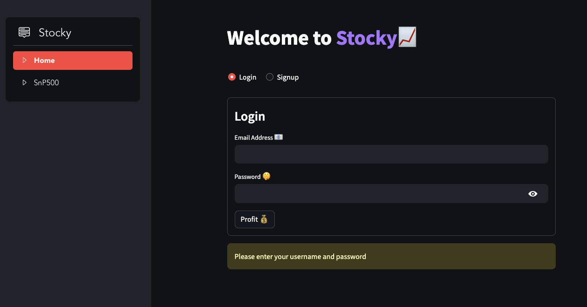

# Stocky


Stocky is a versatile web application designed for stock enthusiasts to effortlessly track and explore stock symbols and market trends. With a powerful FastAPI backend, a user-friendly Streamlit frontend, and seamless integration with MongoDB, Stocky offers a smooth and intuitive experience for staying updated on stock market activities.





## Key Features

- **Stock Watchlist:** Keep track of your favorite stocks and monitor their performance in real-time.
- **Symbol Lookup:** Easily search for stock symbols and retrieve detailed information about companies.
- **S&P 500 Top 10:** View the top 10 companies in the S&P 500 index to stay informed about market leaders.

## Getting Started

### Prerequisites

- Docker 🐋
- Docker Compose

### Installation

1. Clone the repository:

    ```bash
    git clone https://github.com/EASS-HIT-PART-A-2024-CLASS-IV/Stocky.git
    cd app
    ```

2. Build and run the Docker containers:

    ```bash
    docker compose build
    docker compose up
    ```

    


3. Access the application:

    * Open your web browser and go to http://localhost:8501 to interact with the Stocky frontend.
    * To interact with FastAPI backend access http://localhost:4321
    * MongoDB is running on port 27017


4. ????


   
5. Profit:
    💎🙌💰


### Shutdown Procedure

To stop and remove the Docker Compose application, run:

```bash
docker compose down
```

## Demo and Tutorials

### Video Demo

Watch our video demo for a detailed walkthrough of Stocky's features and functionalities.

[Watch the project video demo here](#)https://www.youtube.com/watch?v=kE9tjNjCO5U


[GitHub page](#)https://github.com/AmnonTamsut